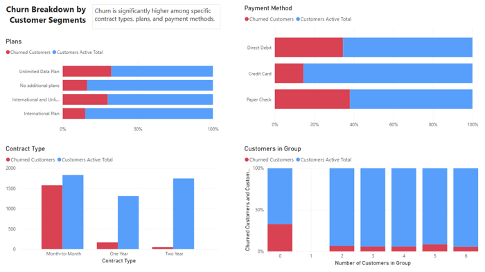
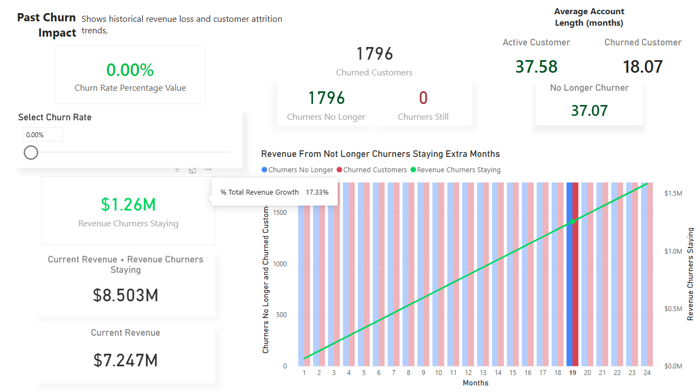
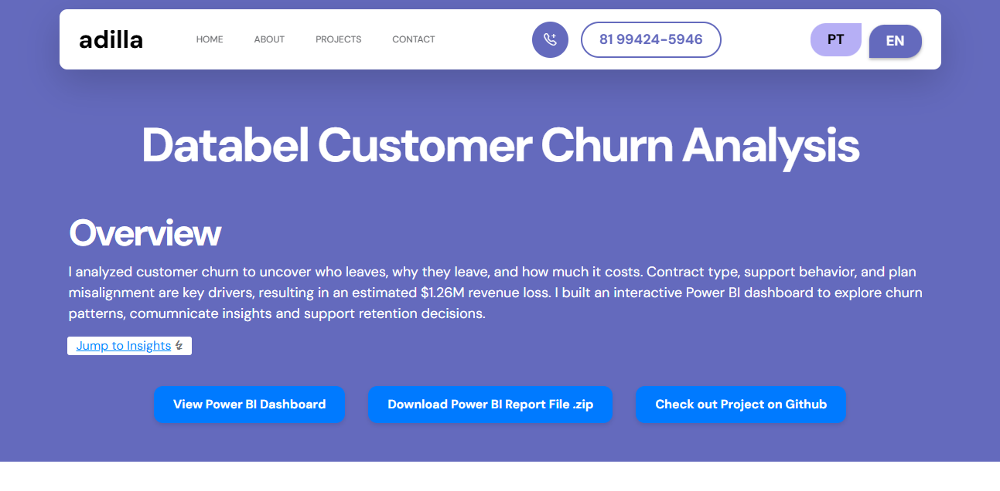

# Databel Customer Churn Analysis

Databel is a telecommunications company operating across the United States. This project analyzes customer churn patterns to provide actionable insights and forecast future revenue impact.

## Project Overview

The goal of this project is to identify the factors driving customer churn—such as contract type, plan selection, demographic factors, and customer behavior—and to estimate both historical and projected revenue losses. The analysis is presented through a dynamic Power BI report with interactive dashboards.

## Dataset

The dataset contains 6,687 customer records, including:

- Demographics
    - State, Age, Gender, Senior, Under 30  

- Contracts
    - Contract Type, Payment Method, Group Participation, International Plan, Unlimited Data Plan, Device Protection & Online Backup  

- Service Usage
    - Account Length, Local Calls & Minutes, International Calls & Minutes, Customer Service Calls, Average Monthly GB Download  

- Charges
    - Monthly Charge, Total Charges, Extra Data & International Charges  

- Churn
    - Churn Label, Churn Category, Churn Reason

> Note: The dataset is a snapshot at a given moment, not temporal data.

## Dashboards

### 1. Executive Overview
Provides a snapshot of:
- Active customers, churned customers, and total revenue  
- Average monthly charges (overall and for churners)  
- Revenue decrease (absolute and %)

### 2. Churn Overview
Highlights churn by:
- Contract type, plan type, payment method, and group participation  
- Key insight: Month-to-month contracts and customers not in groups have the highest churn rates.

 

### 3. Customer Behavior & Risk
Explores behavioral differences between churners and active customers:
- Service calls, account length, and charges  
- Visualizations show churners contact support more and leave earlier, with higher average charges.

### 4. Geographic Analysis
Analyzes churn by location:
- Top 5 states by number of churners (bar chart)  
- Top 5 states by churn rate (funnel)  
- Insight: While churn is fairly consistent, some states show higher customer loss and rate.

### 5. Churn Reasons
Examines the “why”:
- Top churn categories and reasons  
- Tree map highlights distribution of top 5 churn reasons  
- Key driver: Competitor offerings, followed by service experience and pricing.

### 6. Past Speculations
Shows historical revenue impact of churn:
- Total revenue lost from churned customers  
- Running totals and average charges  
- Key metric cards with slicers for analysis

### 7. Future Speculations
Forecasts future churn impact over 48 months:
- Monthly revenue projections with scenario-based analysis  
- Cumulative revenue loss visualization  
- Measures for total revenue shrink, customers lost, and remaining customers

## Methodology

- Created calculated columns and measures for churn, charges, and revenue 
- Created dimension tables for states and other categorical attributes to normalize names and improve filter/relationship performance in Power BI 
- Built bins for age, account length, and charges for better segmentation  
- Normalized plan data to combine unlimited and international plans  
- Used both absolute and relative metrics for clear storytelling

** For a complete breakdown of calculated measures and methodology, see [Technical Documentation](TECHNICAL.md)

## Tools

- **Power BI** for dashboards and interactive visuals  
- **DAX** for calculated columns and measures  
- **Plotly & Dash (future plan)** for web-based interactive version

## Key Insights
1. High-Risk Customer Segments:
    - Month-to-month contract customers and non-group members are the most likely to churn.
2. Behavioral Differences:
    - Churners contact customer service 2.5× more frequently, leave earlier, and pay slightly higher monthly charges.
3. Plan Misalignment:
    - ~80% of churners had the unlimited data plan but used mostly 0–10GB per month, leading to higher charges for unused services.
    - Half of these churners were active internationally but did not have an international plan, resulting in significant extra charges (up to $586).
    - This suggests customers may be choosing plans that don’t fit their usage patterns, driving dissatisfaction and churn.
4. Primary Churn Drivers:
    - Competitor offerings are the top churn reason, followed by service experience and pricing concerns.
5. Revenue Impact:
    - Historical churn has significantly affected revenue. Analysis shows that if past churners had remained active for an average customer lifetime, the company could have generated an additional $1.26M, a 17.33% increase over current total revenue.
    - Future projections indicate that if churn continues at the current rate, the company’s monthly revenue could decrease by 13.6% in two years, amounting to a $20K loss per month.
    - These findings emphasize the financial importance of targeted retention strategies and plan optimization.

<p align="center"> 
    
</p>

## Recommendations / Next Actions

Some actions that can help lowering churn and increasing revenue:

+ Plan Optimization
    + Analyze usage patterns to redesign plans that match customer needs (e.g., international users or low-data users) and reduce overpayment.

+ Targeted Retention Campaigns
    + Focus on month-to-month contract holders and non-group members with high-risk behavior.

+ Proactive Customer Support
    + Identify churn-prone customers early based on service usage and charges, and provide tailored support or incentives.

+ Competitor Benchmarking
    + Investigate competitor offerings that are causing churn and explore competitive adjustments.

+ Future Analysis
    + Incorporate temporal datasets to monitor churn trends over time and refine predictive models.


## Resources

Want to discover new insights and explore the dataset even further?
Have a full interactive experience with the Plotly dashboards on my portfolio **website**!

<p align="center"> 
    
</p>

You can also clone this repository and open the included Power BI file ```(.pbix)``` to explore the dashboards and analyses interactively. All necessary data files are included for a complete experience.
